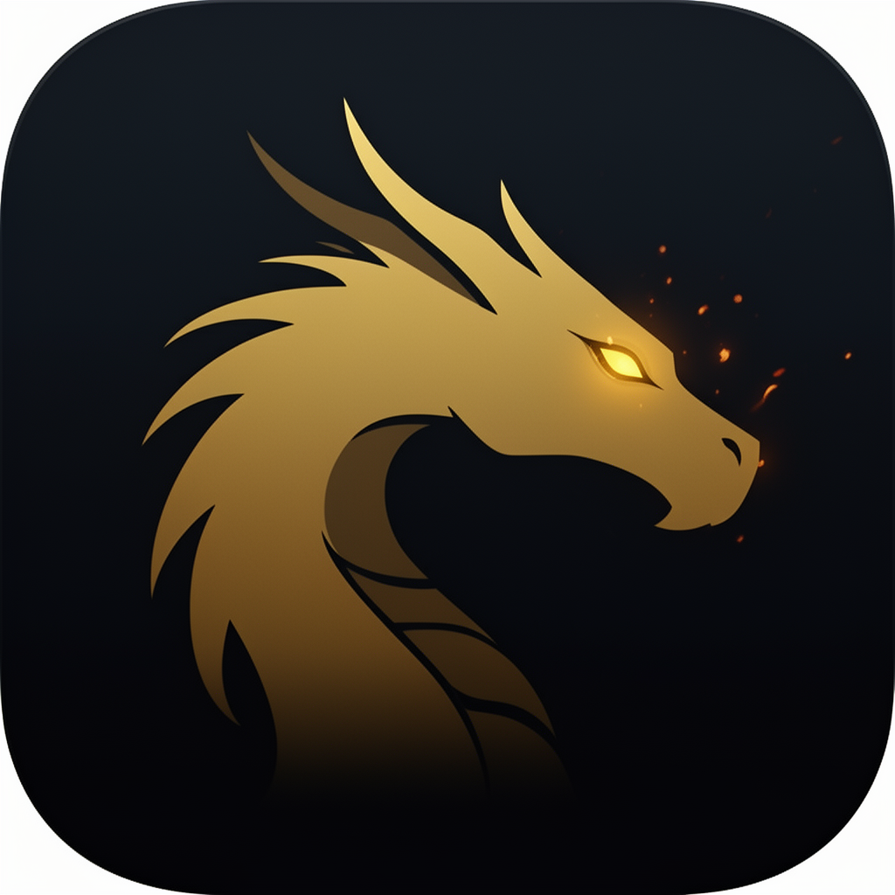
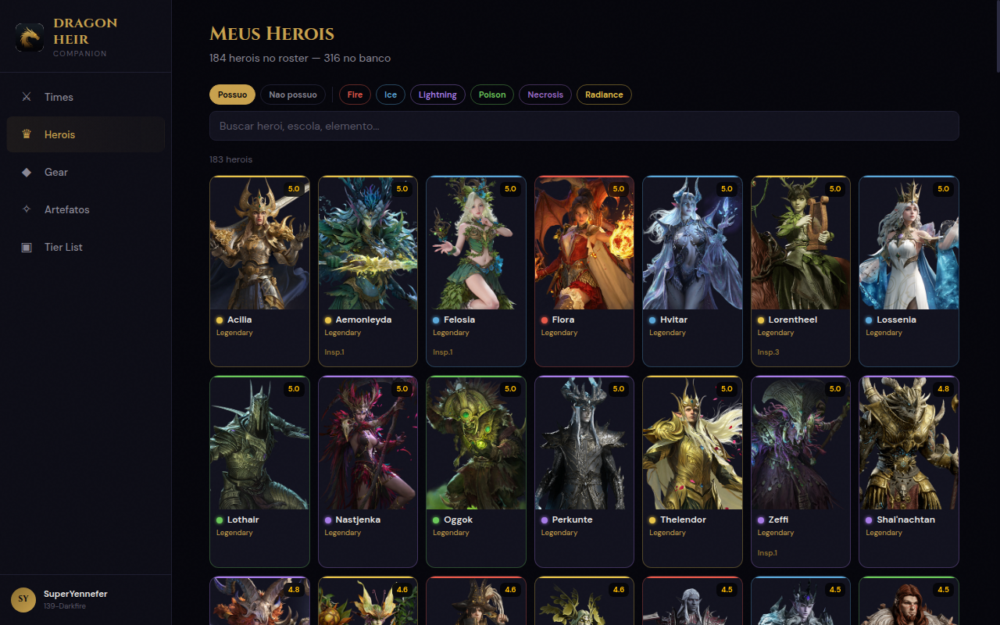
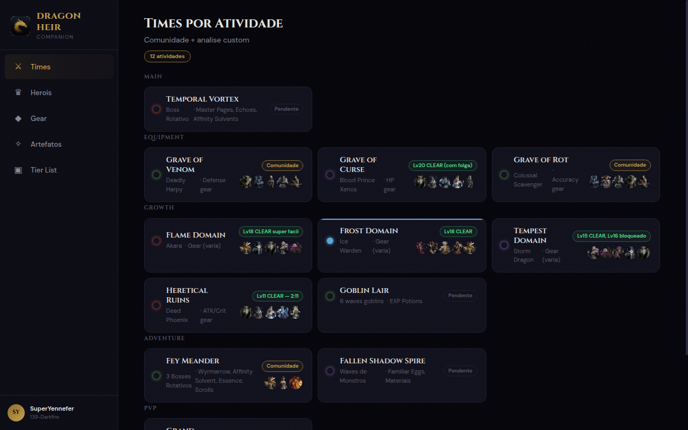
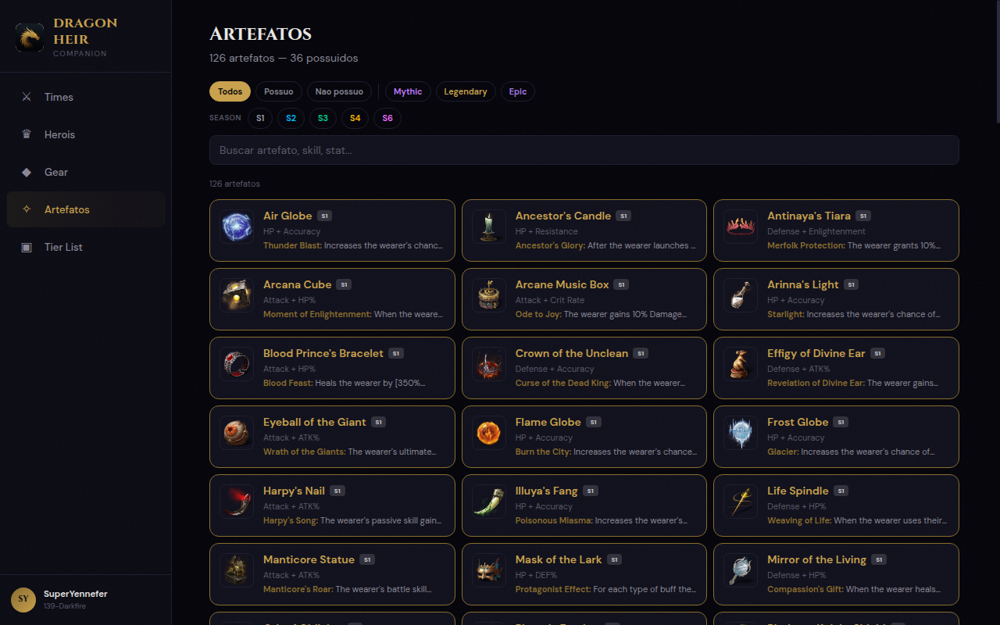
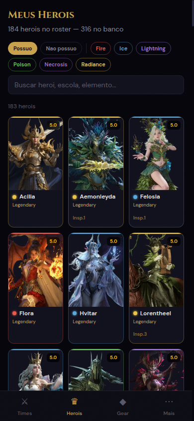
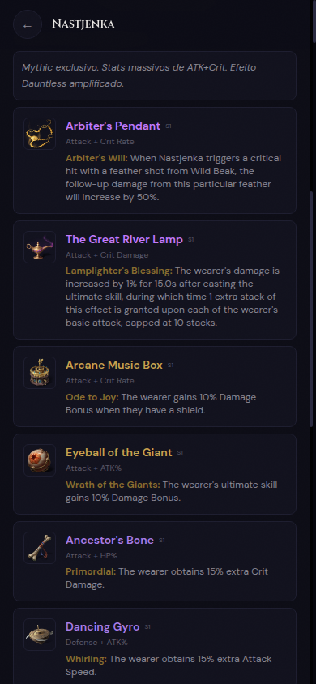

<p align="center">
  
</p>

<h1 align="center">Dragon Heir Companion</h1>

<p align="center">
  Personal game companion for <strong>Dragon Heir: Silent Gods</strong> — knowledge base + web app for roster management, team building, artifact tracking, and strategic planning.
</p>

<p align="center">
  <a href="https://nexus.henryavila.com/dh">Live App</a>
</p>

---

## Screenshots

### Heroes Browser (Desktop)


### Teams by Activity


### Artifact Catalog


<details>
<summary><strong>Mobile Views</strong></summary>

| Heroes Grid | Hero Detail — Artifacts |
|:-:|:-:|
|  |  |

</details>

---

## Features

**Web App** — Vue 3 responsive app with dark fantasy aesthetic

- **Heroes** — Browse 316 heroes with filters (ownership, element, school), search, and detail modal with skills, S6 talent grid, and artifact recommendations
- **Teams** — Team compositions organized by 12 game activities across 5 categories
- **Artifacts** — Full catalog of 126 artifacts (S1–S6) with images, season filter, rarity filter, and ownership tracking
- **Gear** — Quick-reference gear plans for in-game loadout setup
- **Tier List** — Combined tier data from AllClash, HellHades, and DragonHeir.info

**Knowledge Base** — 19 data files for AI-assisted game strategy via terminal

- Roster tracking, resource management, decision history
- Wager mode analysis with pattern recognition and post-mortems
- Game mechanics reference (summoning, combat, gear, cooking, school bonds, resonance)

## Tech Stack

| Layer | Tech |
|---|---|
| Frontend | Vue 3 (Composition API) + Vue Router |
| Styling | Tailwind CSS v4 |
| Build | Vite |
| Data | Runtime-loaded JS globals (`window.DATA_*`) — no rebuild needed for data updates |
| Deploy | Nexus portal (`nexus push`) |
| Fonts | Cinzel (display) + DM Sans (body) |

## Project Structure

```
src/                    Vue 3 components and views
public/data/            Single source of truth — 19 data files (KB + web runtime)
raw-data/               Game API exports from dragonheir.info
docs/                   Game mechanics, guides, hero data
scripts/                Build and data extraction utilities
.ai/memory/             Persistent AI memory for cross-session context
```

## Data Architecture

Game data lives in `public/data/*.js` as `window.DATA_*` globals loaded at runtime via `<script>` tags. This means data updates (new hero obtained, resource spent, team changed) go live with just `nexus push` — no rebuild required.

The web app and the AI terminal assistant read from the same files, eliminating duplication.

## Development

```bash
npm install
npm run dev          # Vite dev server
npm run build        # Production build → dist/
```

## Game Info

- **Game:** Dragon Heir: Silent Gods (Reborn, Jul/2025)
- **Season:** S6 — Hymn of Chess & Blade (Apr/2026)
- **Account:** SuperYennefer, Server 139-Darkfire
